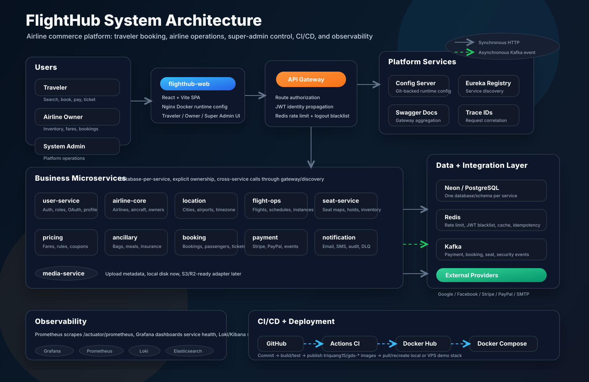
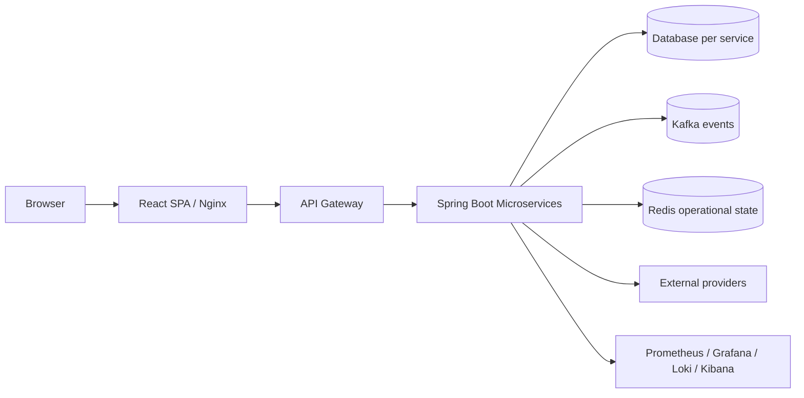
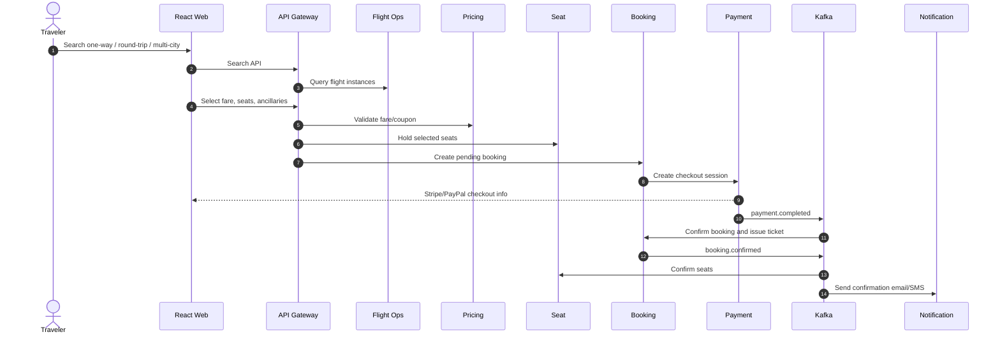
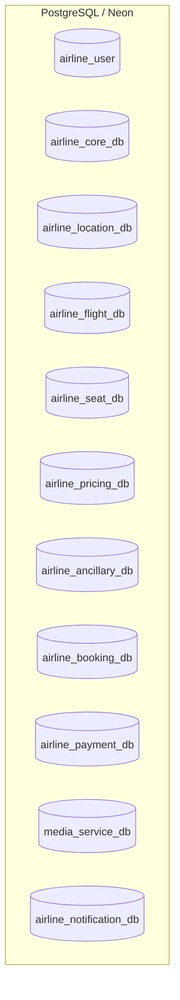
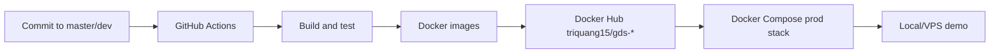

# FlightHub Interview System Architecture

This is the interview-ready architecture summary for FlightHub. It is optimized
for explaining the full project in a senior/tech-lead interview.

## Architecture Image

## 1. Project Summary

FlightHub is an airline commerce and operations platform built with a
microservice architecture. It has three primary user workspaces:

- Traveler workspace: search flights, select fares/seats/ancillaries, pay, and
  receive tickets.
- Airline owner workspace: manage airline profile, aircraft, schedules, seat
  maps, fares, ancillaries, bookings, and owner analytics.
- Super admin workspace: manage users, airlines, network data, integrations,
  notification operations, analytics, and observability links.

## 2. High-Level Architecture

The main architectural decision is to keep business capabilities separated by
domain. Each service owns its own database and exposes APIs through the gateway.
Kafka is used for asynchronous workflows, while Redis is limited to short-lived
operational state.

## 3. Main Components

| Layer | Components | Responsibility |
| --- | --- | --- |
| Frontend | `flighthub-web` | React SPA for traveler, airline owner, and super admin workspaces. |
| Gateway | `api-gateway` | Single browser entrypoint, route authorization, JWT propagation, Redis rate limiting, logout blacklist. |
| Platform | `config-server`, `service-registry` | Centralized runtime config and Eureka discovery. |
| Business services | User, Airline Core, Location, Flight Ops, Seat, Pricing, Ancillary, Booking, Payment, Media, Notification | Domain ownership and business workflows. |
| Data | PostgreSQL or Neon | Database-per-service source of truth. |
| Messaging | Kafka | Payment, booking, seat, flight, and security events. |
| Cache/state | Redis | Rate limit, logout blacklist, cache, notification idempotency. |
| Observability | Prometheus, Grafana, Loki, Elasticsearch, Kibana | Metrics, logs, traces via `traceId`, and operational dashboards. |
| CI/CD | GitHub Actions, Docker Hub, Docker Compose | Build images, publish `triquang15/gds-*`, run prod-like stack locally or on VPS. |

## 4. Service Ownership

| Service | Owns |
| --- | --- |
| `user-service` | Authentication, local login, Google/Facebook social login, users, roles, preferences, profile/avatar links. |
| `airline-core-service` | Airlines, aircraft, owner onboarding, airline approval/suspension lifecycle. |
| `location-service` | Cities, airports, timezone/reference geography, search data support. |
| `flight-ops-service` | Flights, routes, schedules, flight instances, operational availability. |
| `seat-service` | Cabin classes, seat maps, seat instances, seat holds, seat confirmation. |
| `pricing-service` | Fares, fare rules, baggage policies, coupons, coupon redemption validation. |
| `ancillary-service` | Meals, baggage extras, insurance, flight-cabin sellable ancillaries. |
| `booking-service` | Booking lifecycle, passengers, tickets, trip types, checkout state, booking analytics. |
| `payment-service` | Stripe/PayPal checkout, provider verification, refunds, payment events. |
| `media-service` | File upload metadata, validation, local storage now, S3/R2 migration later. |
| `notification-service` | Email/SMS templates, Kafka consumers, delivery tracking, retry and DLQ operations. |

## 5. Key Business Flow: Search to Ticket

Why this matters:

- Booking state is durable in PostgreSQL.
- Payment verification stays inside `payment-service`.
- Seat confirmation happens after successful payment.
- Notification delivery is asynchronous and retryable.

## 6. Event-Driven Design

Kafka is used when downstream work should not block the original request.

| Topic | Producer | Consumers | Purpose |
| --- | --- | --- | --- |
| `payment.completed` | payment-service | booking-service | Mark booking paid and trigger ticket issuance. |
| `payment.failed` | payment-service | booking-service | Mark payment failure and recover booking state. |
| `payment.refunded` | payment-service | booking-service | Update booking refund state. |
| `booking.confirmed` | booking-service | notification-service, seat-service | Send confirmation and finalize seats. |
| `flight-instance-created` | flight-ops-service | seat-service | Generate seat inventory for a new flight instance. |
| `user.password-reset-requested` | user-service | notification-service | Send password reset email. |
| `security.suspicious-login` | user-service | notification-service | Notify account owner of suspicious login. |

DLQ topics follow the `.DLQ` suffix pattern.

## 7. Data Architecture

FlightHub uses database-per-service ownership.

Service boundaries:

- PostgreSQL is the source of truth.
- Kafka carries facts after state is persisted.
- Redis is not used as durable business storage.
- Booking snapshots important commercial data so historical bookings are stable
  even if upstream fare or schedule data changes later.

## 8. Security Design

- Browser traffic enters through `api-gateway`.
- Gateway validates JWT and route roles.
- Gateway injects trusted identity headers for downstream services.
- Services must not trust client-supplied identity headers.
- Logout uses Redis-backed JWT blacklist.
- Google/Facebook identity tokens are verified by `user-service`.
- Payment webhooks are routed separately and verified by `payment-service`.

## 9. Media Design

`media-service` centralizes file handling:

- validates upload file type and size,
- stores media metadata,
- serves file references,
- supports user avatars, airline logos, route images, ancillary icons, and meal
  images,
- keeps storage pluggable so local disk can move to S3/R2 later.

Interview talking point: business services store media references; they do not
own raw binary storage.

## 10. Deployment and CI/CD

Current deployment shape:

- GitHub Actions builds backend and frontend images.
- Images are pushed to Docker Hub.
- `docker-compose.prod.yml` runs the stack from published images.
- Neon can host Postgres databases to reduce local/VPS memory.
- `.env.docker.local` provides runtime secrets and provider configuration.

## 11. Observability

Observability is split between product UI and operational tools:

- Super admin UI links to observability tools and selected health summaries.
- Prometheus scrapes `/actuator/prometheus`.
- Grafana shows health, throughput, latency, Kafka, and Redis dashboards.
- Loki and Kibana support log search by `traceId`.
- Each request logs a `traceId` at gateway and services for debugging flow.

## 12. Production Readiness Talking Points

Strong areas:

- clear domain boundaries,
- API gateway as a security boundary,
- database-per-service ownership,
- Kafka for asynchronous workflows,
- Redis used only for temporary operational state,
- centralized media service for S3-ready uploads,
- Docker Hub based CI/CD,
- observability stack with trace ID troubleshooting,
- realistic demo data and admin/owner/traveler flows.

Known next steps:

- move secrets to a managed secret store,
- add public domain, HTTPS, and reverse proxy,
- use managed Redis/Kafka/Postgres for real production,
- add post-deploy smoke tests,
- add backup/restore runbook,
- add S3/R2 storage adapter and CDN,
- add stricter readiness gates before exposing UI traffic after deploy.

## 13. Two-Minute Interview Pitch

FlightHub is an airline commerce platform built as a Spring Boot microservice
system with a React frontend. The system is divided by business capability:
users, airlines, locations, flight operations, seats, pricing, ancillaries,
booking, payment, media, and notification. Browser traffic enters through an API
Gateway that handles authorization, identity propagation, rate limiting, and
logout blacklist checks.

Each service owns its own database, with PostgreSQL or Neon as the durable
source of truth. Kafka is used for asynchronous workflows such as payment
completion, booking confirmation, seat finalization, flight instance inventory
generation, password reset, and suspicious-login alerts. Redis is used only for
short-lived state such as rate limits, JWT blacklist, caches, and notification
idempotency.

The platform is deployable through GitHub Actions and Docker Hub images using a
production-like Docker Compose stack. Observability is supported by Prometheus,
Grafana, Loki, Elasticsearch, and trace ID based log correlation. Media upload is
centralized in `media-service`, so the current local-disk implementation can
migrate to S3 or R2 without changing the business services.

