# FlightHub System Architecture

FlightHub is a microservice-based airline commerce platform. It supports
traveler search and checkout, airline-owner operations, system-admin controls,
media uploads, notification delivery, and production-style observability.

This document explains the technical architecture at a system level. For
service-by-service business ownership, see `../business-overview/README.md`.
For local Docker image startup, see `../guide/docker-production-runbook.md`.

## 1. Architecture Goals

- Keep browser traffic behind a single API Gateway.
- Keep each business domain independent with its own database.
- Use Kafka for asynchronous state propagation and notification workflows.
- Use Redis only for short-lived operational state and cache.
- Keep media storage abstracted so local disk can move to S3 or R2 later.
- Make the demo stack deployable from Docker Hub images with managed Postgres.
- Keep observability separate from business screens while still linking it from
  the super-admin workspace.

## 2. System Context

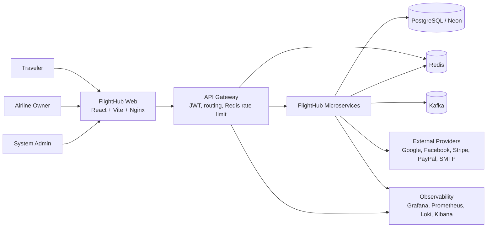

## 3. Runtime Container View

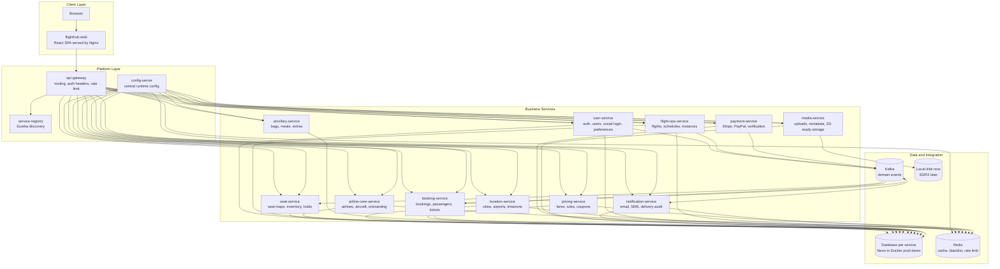

## 4. Service Ownership Map

| Service | Owns | Does not own |
| --- | --- | --- |
| `api-gateway` | Entry routing, role checks, JWT propagation, logout blacklist, rate limit | Business state |
| `user-service` | Accounts, roles, social login, profile, preferences, avatar ownership links | Booking lifecycle |
| `airline-core-service` | Airlines, aircraft, ownership, onboarding status | Flight instance inventory |
| `location-service` | Cities, airports, timezone/reference geography | Fares or routes as commercial products |
| `flight-ops-service` | Flights, schedules, instances, route operations | Payments or tickets |
| `seat-service` | Cabin classes, seat maps, seat instances, holds and confirmations | Fare pricing |
| `pricing-service` | Fares, fare rules, baggage policies, coupons | Payment provider verification |
| `ancillary-service` | Meals, baggage extras, insurance, flight-cabin extras | Booking totals as source of truth |
| `booking-service` | Bookings, passengers, tickets, checkout state, booking analytics | Card/PayPal provider ownership |
| `payment-service` | Stripe/PayPal checkout sessions, provider verification, payment events | Seat confirmation |
| `media-service` | Media metadata, file validation, storage adapter | Business approval rules |
| `notification-service` | Email/SMS templates, event delivery, delivery audit, DLQ visibility | Source business decisions |

## 5. Data Ownership

Each business service owns its own database schema. In the Docker production demo,
the databases can be hosted on Neon to reduce Docker memory usage.

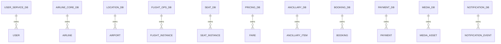

Cross-service references use IDs and snapshots. For example, booking stores the
selected flight, fare, passenger, seat, coupon, and payment identifiers needed
to reconstruct the booking later without making mutable upstream data the
historical ticket contract.

## 6. Traveler Search and Checkout Flow

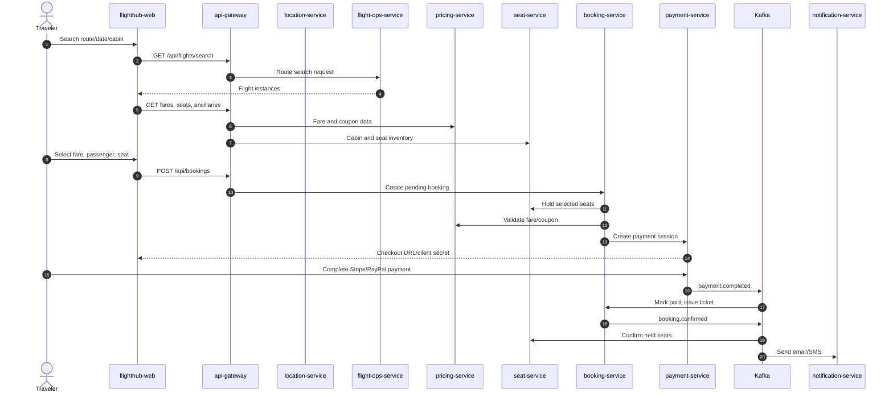

## 7. Airline Owner Operations Flow

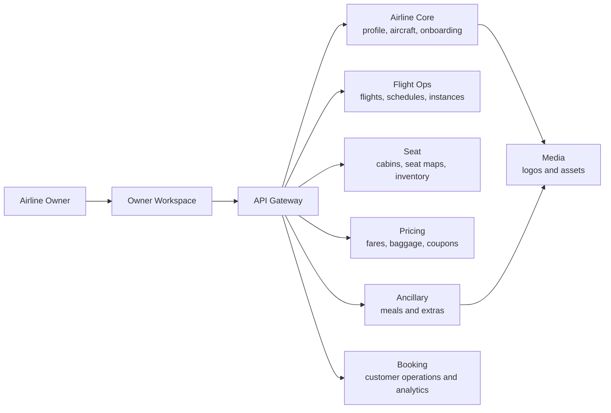

The owner workspace is operational, not marketing-oriented: it manages inventory,
commercial rules, seat maps, customer bookings, and owner-level analytics.

## 8. Admin and Operations Flow

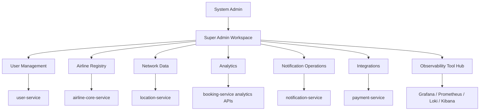

## 9. Kafka Event Topology

Kafka carries events after durable business state has been saved in PostgreSQL.
It is not the system of record.

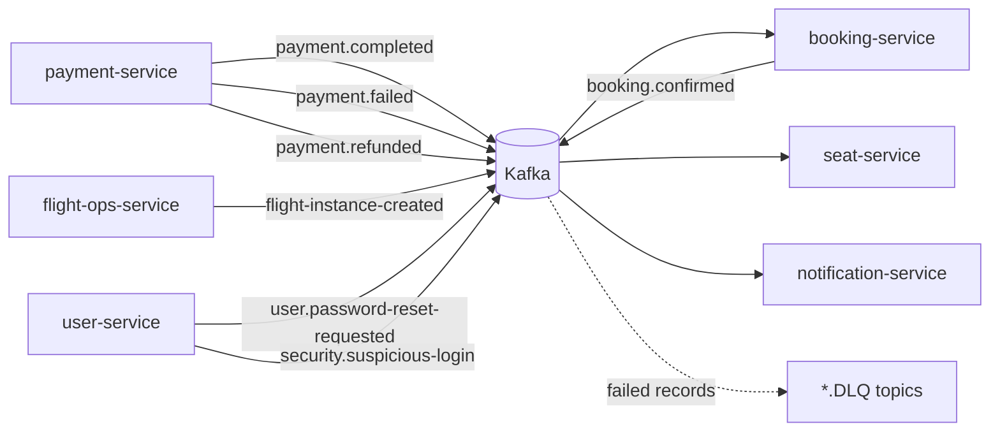

Production rules are detailed in `../guide/kafka-production-usage.md`.

## 10. Redis Usage

Redis is used for short-lived operational state:

- Gateway rate limiting.
- Gateway JWT logout blacklist.
- Notification idempotency keys.
- Read-through caches for reference or frequently read data.

Redis does not own bookings, payments, seats, users, uploaded media metadata, or
notification delivery audit records. Details are in
`../guide/redis-production-usage.md`.

## 11. Media Storage Architecture

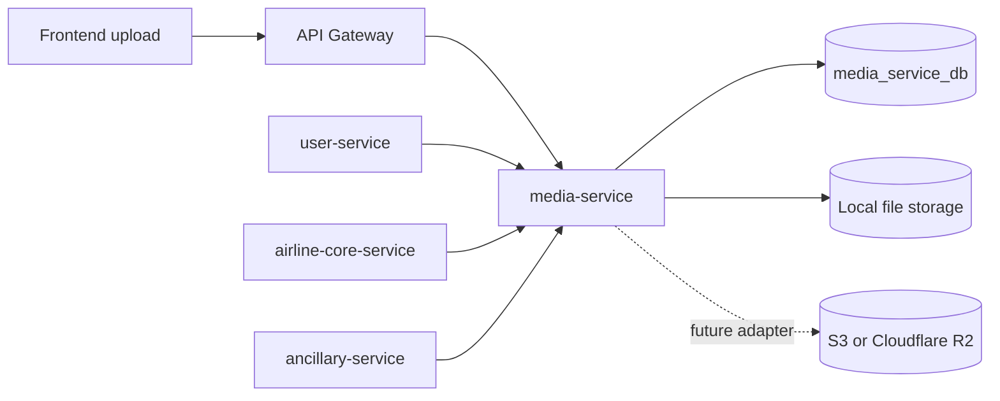

The rest of the system stores media references, not raw files. This keeps future
S3/R2 migration contained inside `media-service`.

## 12. Security Architecture

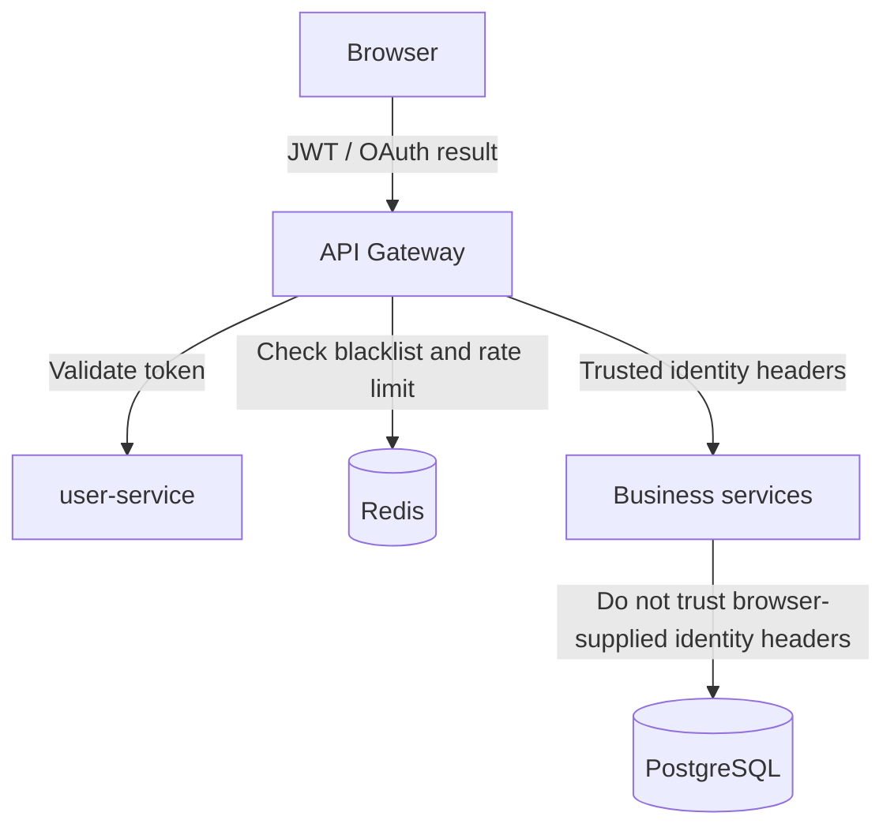

Security boundaries:

- Browser calls should enter through `api-gateway`.
- Gateway owns route authorization and propagates trusted identity headers.
- Services should treat client-supplied identity headers as untrusted.
- Logout uses Redis-backed token blacklist until token expiry.
- Google and Facebook login are validated by `user-service`.
- Secrets belong in env files, GitHub Actions secrets, or a secret manager.

## 13. Observability Architecture

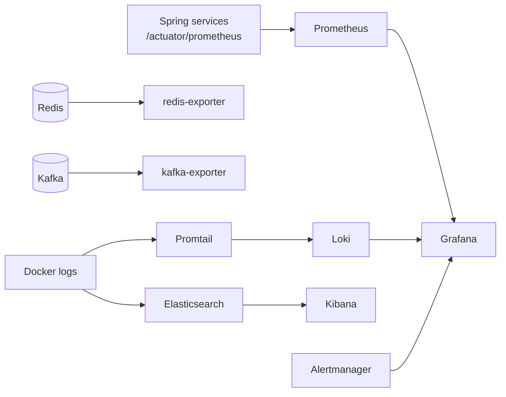

Primary usage:

- Grafana: dashboards for service health, throughput, latency, Redis, Kafka.
- Prometheus: raw metrics and target scrape status.
- Loki/Grafana Explore: service logs and trace ID search.
- Elasticsearch/Kibana: indexed operational log exploration.
- Super Admin UI: links to the tool hub and selected operational summaries.

See `../guide/observability-usage-guide.md` for day-to-day usage.

## 14. Docker Production Demo Topology

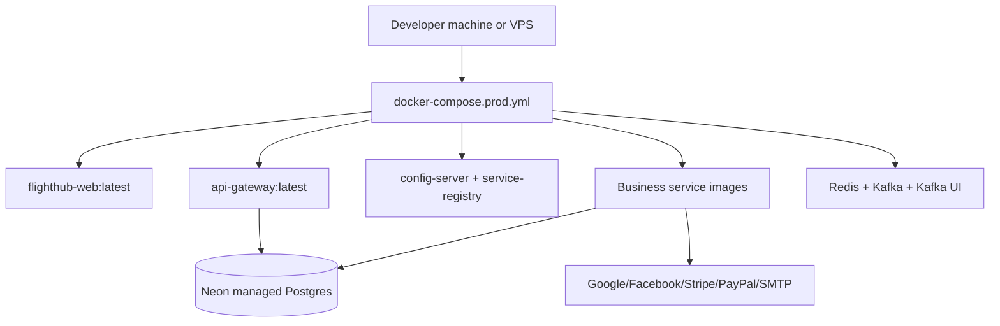

The production-like Docker demo uses Docker Hub images and can avoid local
PostgreSQL containers by setting:

```text
FLIGHTHUB_PROD_PROFILES=none
```

Then service databases point to Neon JDBC URLs from `.env.docker.local`.

## 15. CI/CD Image Flow

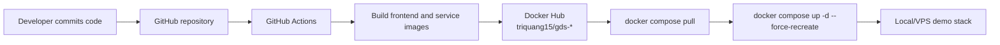

For local production-style testing after a code fix:

1. Commit and push code.
2. Wait for GitHub Actions Docker publish success.
3. Pull images.
4. Recreate the changed services.
5. Wait for gateway health and Eureka registration before testing UI flows.

## 16. Core Runtime Endpoints

| Component | Local URL |
| --- | --- |
| Web app | `http://localhost:5173` |
| API Gateway | `http://localhost:8080` |
| Eureka | `http://localhost:8761` |
| Config Server | `http://localhost:8888` |
| Kafka UI | `http://localhost:8000` |
| Grafana | `http://localhost:3001` |
| Prometheus | `http://localhost:9090` |
| Loki | `http://localhost:3100` |
| Elasticsearch | `http://localhost:9200` |
| Kibana | `http://localhost:5601` |

## 17. Production Readiness Notes

Already production-shaped:

- Gateway entrypoint and route-level role controls.
- Service discovery and central config.
- Database-per-service ownership.
- Kafka event integration with DLQ design.
- Redis short-lived state usage.
- Docker Hub image publishing.
- Docker production runbook with Neon option.
- Media-service abstraction for future S3/R2.
- Observability stack and trace ID logging.

Next hardening areas:

- Move secrets to a secret manager on real hosting.
- Add TLS and reverse proxy for public domains.
- Use managed Redis/Kafka/Postgres for long-running production.
- Add stronger service readiness gates before exposing UI traffic.
- Add automated smoke tests after Docker image deploy.
- Add backup and restore procedures for each database.
- Add S3/R2 storage adapter and CDN for public media.

